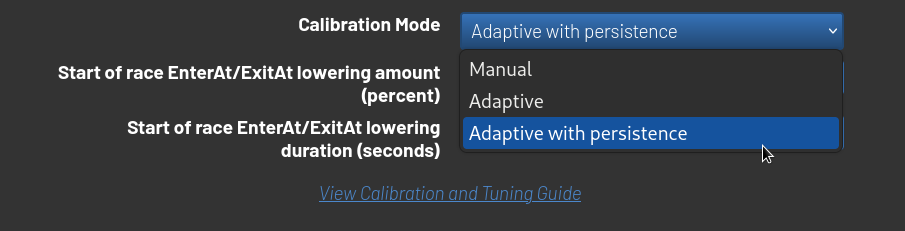

# RotorHazard plugin for calibration mode: Adaptive with persistence

Standard RotorHazard adaptive calibration mode will attempt to "personalize" calibration values to pilot as much as is possible (obviously with some limitations, e.g. without crossing node boundary).
This allows a lot of flexibility allowing race directors to adapt to differences in drone VTX'es during the race.
Tracking of this calibration data is currently retrievied from history race data, which is generally really nice place to retrieve that data, but have a small ceveat.
This data is not persisted between events, therefore if race director is running events in periodic fashion (e.g. Weekly) he/she may want to store those values persistenly between events, such that if some pilot has flown on specific node some time in the past - the calibration values would be inherited for all future races.

This plugin achieves that, but requires currently unreleased RotorHazard version.
Once release is done, this readme should be updated.

## Installation

```sh
cd RotorHazard/src/server/plugins
git clone https://github.com/Jauler/RotorHazard_adaptive_calibration_with_persistence.git
sudo systemctl restart rotorhazard.service
```

Then go to Calibration Modes in settings tab and select "Adaptive with Persistence":


## Clearing persistant data

Currently there is no user-friendly method to delete persistent data, therefore it have to be done manually:

```sh
rm RotorHazard/src/server/adaptive-calibration-persitant-data.json
```


